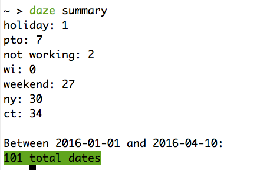
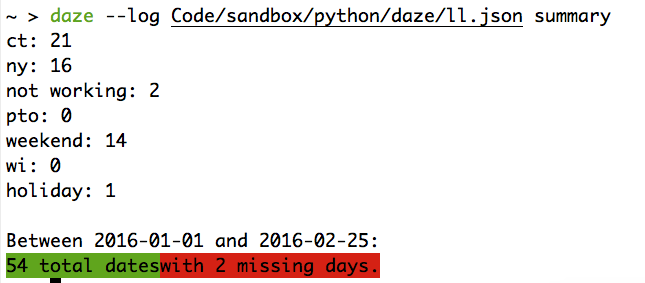
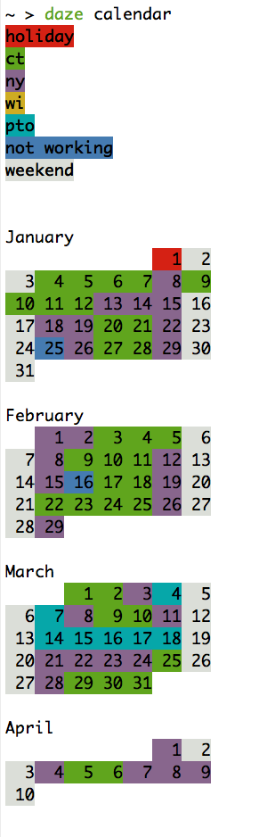

# Daze

Daze is a day-based time-tracking command line utility.

My use for it (and therefore a lot of the terminology) is to track which days I'm working, in which state, or why I'm not.

My goal was to minimize the chance I would miss a day, have stats available for the year and month, and make easy to adjust errors.


### To address those goals:

1. Daily entry is done by means of cron job that checks every 15 minutes from 9am-8pm whether I've logged a location yet.  If not, it uses dialog boxes to ask me where I'm working and logs it.  There's a second cron job that creates a backup of the log file every few days.  This is primarily because I wanted to have a safety system while developing that would save me from a bug that deleted entries, for instance. But it seems like a mildly useful enough feature that I haven't deleted it.

2. Statistics can be checked in a "summary" or "calendar" view.

Summary lists number of days in each location, the earliest and latest dates in the logs, and whether any dates are missing.

[A visual (asciinema) demo](https://asciinema.org/a/cg01t7aj5lv9u53f8jeggja8d)





It also has a visual calendar mode.



3. Errors are easy to find with the calendar/summary mode and can be fixed through the interface by just doing a `daze add weekend 2016-04-09`, for instance.  Additionally, the storage format is a json that makes for very easy manual editing.


### Usage example:

```shell
$ daze add 2016-06-15 guilford
$ daze summary


### Improvements
- [ ] Implement a good frontend interface!
- [ ] Turns out there's a calendar module! Should definitely be used for my cal function.
- [ ] Build the setup function (create a ~/.daze directory with a log, backups, and settings, possibly cron job)
- [ ] Add a cli backup function
- [ ] Refactor out the apple dialogs
- [ ] Write up install instructions
- [ ] Implement the remove date function
